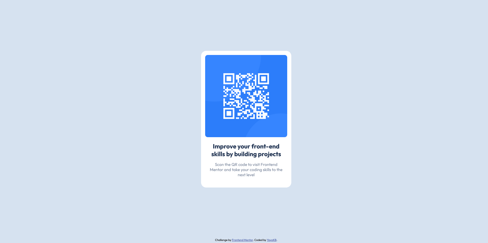

# Frontend Mentor - QR code component solution

This is a solution to the [QR code component challenge on Frontend Mentor](https://www.frontendmentor.io/challenges/qr-code-component-iux_sIO_H). Frontend Mentor challenges help you improve your coding skills by building realistic projects.

## Table of contents

- [Overview](#overview)
  - [Screenshot](#screenshot)
  - [Links](#links)
- [My process](#my-process)
  - [Built with](#built-with)
  - [What I learned](#what-i-learned)
- [Author](#author)

## Overview

### Screenshot

### Links

- Solution URL: [GitHub](https://github.com/YayoKB/fem-qr-code-component)
- Live Site URL: [GitHub Pages](https://yayokb.github.io/fem-qr-code-component)

## My process

### Built with

- HTML5
- CSS3
- Flex

### What I learned

Not too much really. :)

## Author

- GitHub - [YayoKB](https:/www.github.com/YayoKB)
- Frontend Mentor - [@YayoKB](https://www.frontendmentor.io/profile/YayoKB)
